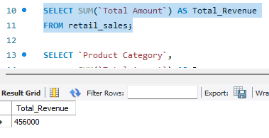
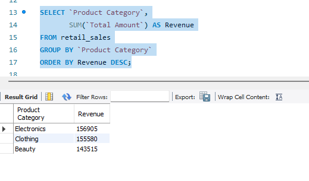
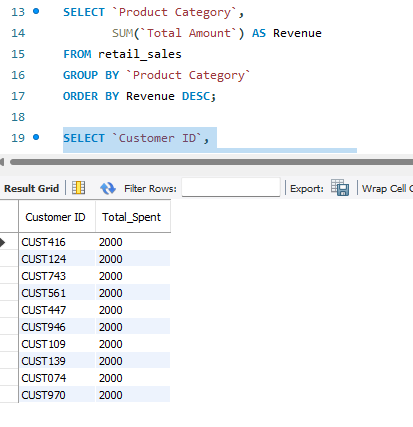
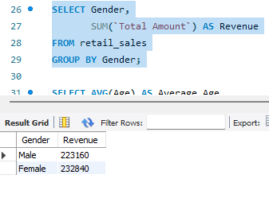
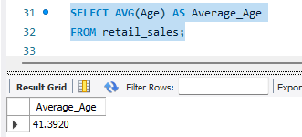
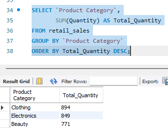

# Retail Store SQL Analysis

## Overview
This project uses SQL to analyze retail sales data and answer business questions about revenue, customers, products, and sales performance.

## Tools Used
- SQL
- SQLite / DB Browser for SQLite
- GitHub

## Business Questions
1. What is the total revenue?
2. Which products generate the most revenue?
3. Which customers spend the most?
4. Which categories perform best?
5. What are the monthly sales trends?

## Project Files
- `retail_store_data.csv` - Retail sales dataset
- `sql_queries.sql` - SQL queries used for analysis
- `screenshots/` - Query results screenshots

## Key Insights
- Calculated total retail revenue using SQL aggregate functions
- Identified top-performing product categories
- Analyzed highest spending customers
- Compared revenue across customer genders
- Calculated average customer age
- Identified highest quantity product categories sold

## Query Results

### Total Revenue


### Top Product Categories


### Top Customers


### Revenue by Gender


### Average Customer Age


### Highest Quantity Products


## How to Run

1. Open MySQL Workbench

2. Create a database

```sql
CREATE DATABASE retail_analysis;
USE retail_analysis;
```

3. Import the retail sales CSV dataset into MySQL

4. Run the queries from:

```txt
sql_queries.sql
```

5. Analyze the query outputs and business insights


